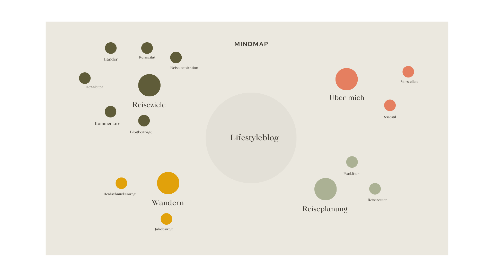

#  :earth_africa: Reiseblog - HTML & CSS Website

Dies ist ein Website-Projekt für das UIUX-Design, das mit HTML und CSS erstellt wurde. Die Website ist ein Reiseblog mit verschiedenen Seiten, wie Packlisten, Reiseziele, Über mich und Wandern. Es gibt ein Formularfeld mit Kommentarfunktion und ein Carousel für Reiseinspirationen.

## :writing_hand: Vorbereitung

#### Wireframe mit Figma


#### Mindmap mit Canva



## :film_strip: Slideshow mit HTML und CSS erstellen

### HTML
```
<section class="slideshow-container">
        <h3>Reiseinspiration</h3>
        <div class="slider">
          <div class="slide">
            <input type="radio" name="slide" id="img1" checked />
            <input type="radio" name="slide" id="img2" />
            <input type="radio" name="slide" id="img3" />
            <input type="radio" name="slide" id="img4" />
            

            

            
            
            <a href="" class="caption caption1"
              >deinTEXT</a
            >
            <a href="" class="caption caption2"
              >deinTEXT</a
            >
            <a href="" class="caption caption3"
              >deinTEXT</a
            >
            <a href="" class="caption caption4"
              >deinTEXT</a
            >
          </div>
        </div>
        <div class="dots">
          <label for="img1"></label>
          <label for="img2"></label>
          <label for="img3"></label>
          <label for="img4"></label>
        </div>
            </section> 
```
### CSS

```
.slideshow-container {
  width: 80%;
  height: 40rem ;
  margin: 0rem auto;
  border-radius: 1rem;
  display: flex;
  flex-direction: column;
  justify-content: center;
  align-items: center;
  background-color: var(--four-bg);
  
}

.slider {
  display: flex;
 justify-content: center;
  margin: 2rem 0;
  width: 80%;
  height: 27rem;
  scroll-snap-type: x mandatory;
  scroll-behavior: smooth;

}

.slide {
  display: flex;
  scroll-snap-align: start;
  overflow: hidden;
  width: 35rem;
  height: 27rem ;
  position: relative;
}


.slide img {
  width: 100%;
  height: 100%;
  object-fit: cover;
  transition: all 0.15s ease;
  border-radius: 1rem;
  
}

.caption:hover {
  transform: scale(1.05);
}

.slider input {
  display: none;
}

.dots {
  display: flex;
  justify-content: center;
  align-items: end;
  margin: 1rem;
}

.dots label {
  height: 20px;
  width: 20px;
  border-radius: 50%;
  border: solid black 3px;
  cursor: pointer;
  transition: all 0.15s ease;
  margin: 2px;
}

.dots label:hover {
  background-color: grey;
}

.caption{

  color: black;
  text-decoration: none;
  font-weight: 700;
  text-align: center;
  padding:1rem;
  border-radius: 1rem;
 display: inline-block;
  position: absolute;
 left: 0;
 right: 0;
  bottom: 0;
  background-color: var(--four-bg);
z-index: 2;
}

.caption:hover  {
  transform: scale(1.05);
  box-shadow: var(--box-shadow);
  
}

#img1:checked ~ .slide-one {margin-left: 0;}
#img2:checked ~ .slide-two {margin-left: -100%;}
#img3:checked ~ .slide-three {margin-left: -200%;}
#img4:checked ~ .slide-four {margin-left: -300%;}

.caption1, .caption2, .caption3, .caption4 {
  display: none;
}
#img1:checked ~ .caption1 {display: block;}
#img2:checked ~ .caption2 {display: block;}
#img3:checked ~ .caption3 {display: block;}
#img4:checked ~ .caption4 {display: block;}
```

##### :soon: Erster Blogbeitrag

Der erste Blogbeitrag folgt in Kürze.